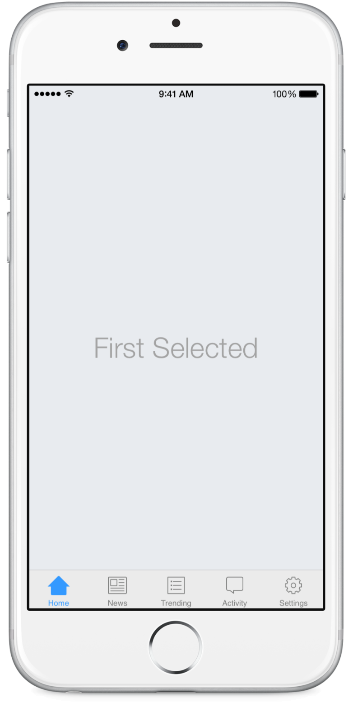
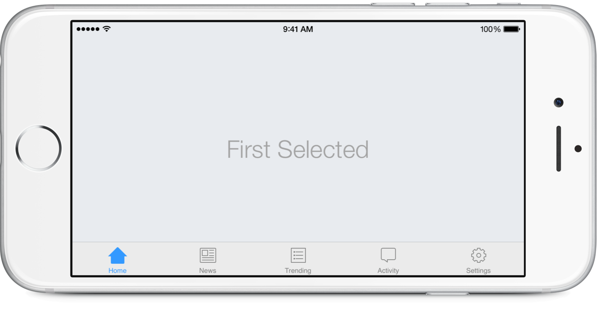
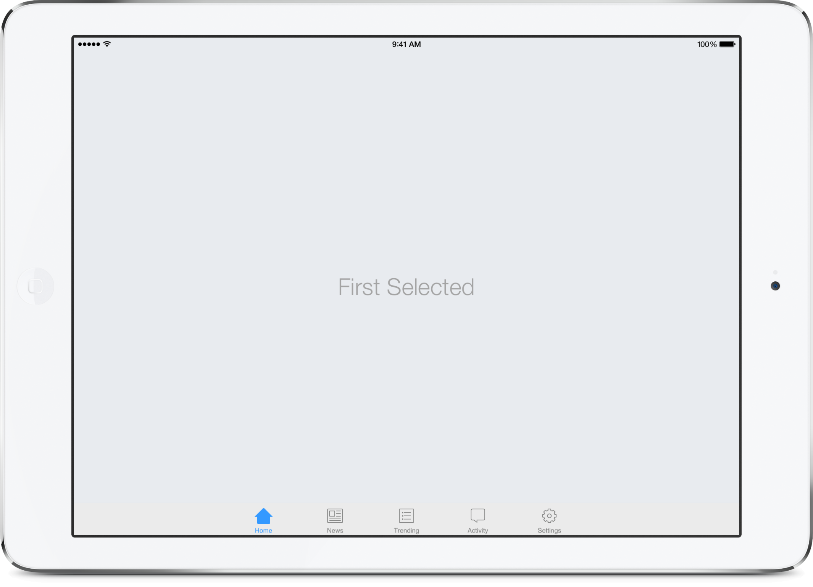

Origami TabBar
===========

Responsive iOS UITabBar Template for the prototyping tool Origami (by Facebook)

My goal, by opensourcing this project, is to make it easier and faster for designers to start with a project that requires them to use the native iOS Tab Bar.

Enjoy responsibly and build something awesome! (it would be nice if you would email me and let me know what you built with this template)

## Features
- Looks and behaves **exactly** as the Apple's own iOS UITabBar (I realize that this is a bold statement, but go and see for yourself)
- Responsive
- Customizable Labels
- Automatic Tint for the Selected State
- Live Image Support

## How to Use
- Clone this repo
- Open the **UITabBarController.qc**
- Have fun!

## Dependencies
Requires [Quartz Composer](http://adcdownload.apple.com/Developer_Tools/graphics_tools_for_xcode__xcode_6.1/graphicstools_for_xcode_6.1.dmg "Quartz Composer") and [Origami](http://facebook.github.io/origami/download/ "Origami") 

## Known Issues
- Prototype was not tested on devices with @1x and @3x displays
- May be a little bit laggy
